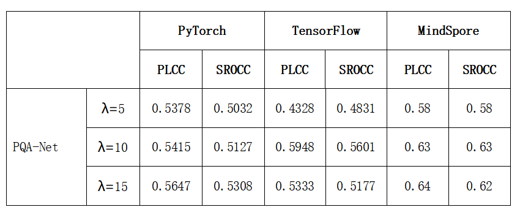

# PQA-Net
This is the repository of PQA-Net. The original code is implemented by Pytorch, while we provide Mindspore and Tensorflow.
Key words: point cloud quality assessment, no-reference
In this case, the original implementation of PyTorch is as follows:
https://github.com/qdushl/PQA-Net

## Environment
For PQA-Net-mindspore:
ubuntu 16.04
python 3.7
mindspore 2.0, installation reference: https://www.mindspore.cn/install

For PQA-Net-tensorflow:
ubuntu 16.04
python 3.7
tensorflow-gpu 2.x

## Dataset
Download the datasets from "数据集" named "distortion.zip", and then store them in the specified path

## Training 

For mindspore, 
```shell 
cd ./PQA-Net-mindspore
python MainDTLQ.py
python MainLQ.py
```

For tensorflow, 
```shell 
cd ./PQA-Net-tf
python distortion.py
python regression.py
```


## Performance comparison
Benchmark test on mindspore, tensorflow and pytorch below
Paper:



## Citation 
```
@article{liu2021pqa,
  title={PQA-Net: Deep no reference point cloud quality assessment via multi-view projection},
  author={Liu, Qi and Yuan, Hui and Su, Honglei and Liu, Hao and Wang, Yu and Yang, Huan and Hou, Junhui},
  journal={IEEE Transactions on Circuits and Systems for Video Technology},
  volume={31},
  number={12},
  pages={4645--4660},
  year={2021},
  publisher={IEEE}
}
```

## contributors

name: Zhang Yongchi && Haohui Li
email: zhangych02@pcl.ac.cn
