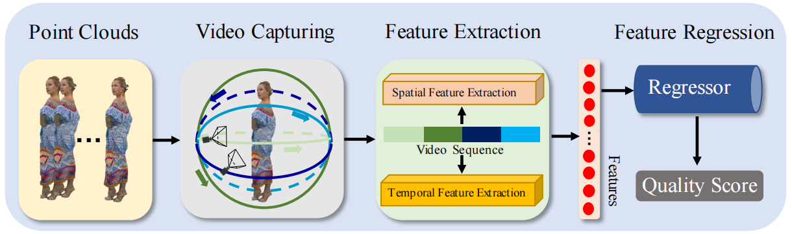
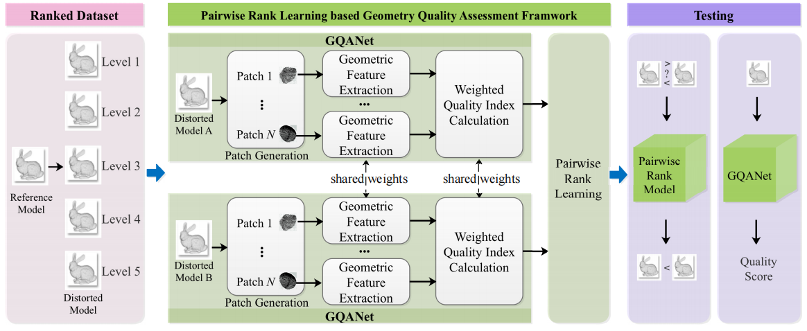
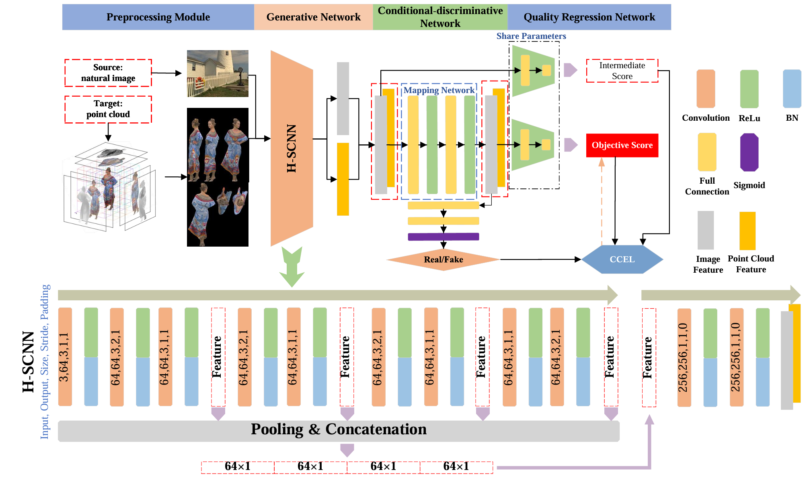
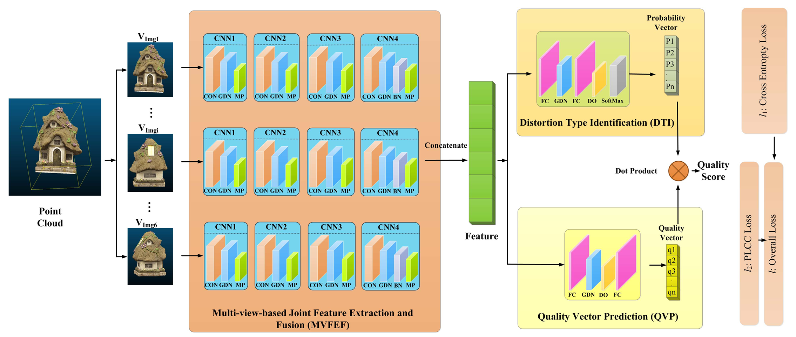
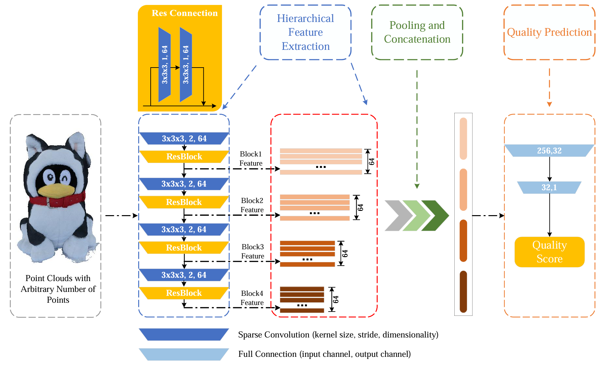
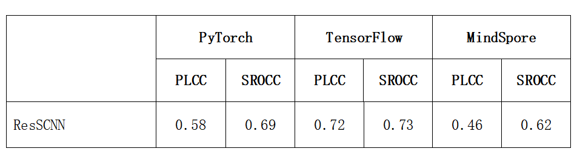

<div align="center">


# OpenPCQA

**An Open-Source Algorithm Library of Point Cloud Quality Assessment Based on Deep Learning**

[](#-license)
[](#)
[](#)
[](#)
[](https://openi.pcl.ac.cn/OpenPCQA/OpenPCQA)
[](#-contributing)
[](https://github.com/Terriao/OpenPCQA/issues)

*A unified multi-framework benchmark for deep-learning-based Point Cloud Quality Assessment.*

</div>

---

## 📖 Overview

**OpenPCQA** is a unified, open-source library that brings together representative deep-learning methods for **Point Cloud Quality Assessment (PCQA)** — the task of predicting the perceived visual quality of a 3D point cloud after it has been compressed, transmitted, downsampled, or otherwise degraded.

The library provides reproducible implementations of five widely cited PCQA models in **PyTorch**, **TensorFlow**, and **MindSpore**, together with a common evaluation protocol on **SJTU-PCQA**, **WPC**, **LS-PCQA**, and **PRLD** datasets.


---

## 🎯 Why OpenPCQA?

The PCQA research community faces several long-standing pain points:

| Problem | OpenPCQA's Solution |
|---------|---------------------|
| 🔀 Methods are scattered across repositories with inconsistent conventions | ✅ A **single unified library** with consistent APIs and structure |
| 🐍 Most code exists only in PyTorch | ✅ **Triple-framework parity** (PyTorch · TensorFlow · MindSpore) |
| 📊 Reported numbers are hard to reproduce due to undocumented splits & seeds | ✅ **Fixed configs, and data splits** for every experiment |
| ⏱️ No fair speed/memory comparison across frameworks | ✅ **Standardized inference-time & GPU-memory profiling** |
| 📚 Newcomers struggle to find a baseline to start from | ✅ A **curated zoo** of 5 representative methods with one-command training |

---

## ✨ Project Highlights

- 🧩 **5 representative PCQA algorithms** spanning projection-based and model-based paradigms
- 🔁 **Triple-framework support** — every algorithm has PyTorch, TensorFlow, and MindSpore implementations
- 📈 **Cross-framework benchmark** on SJTU-PCQA, WPC, LS-PCQA, and PRLD
- ⚡ **Profiling included** — both inference latency and GPU memory footprint
- 🧪 **Reproducible by design** — configs, seeds, pretrained weights and environment specs shipped together
- 🎓 **Educational** — each subproject contains the original paper and architecture diagrams
- 🤝 **Community-driven** — contributions of new methods, frameworks, and datasets are welcomed

---

## 📑 Table of Contents

- [Background: What is PCQA?](#-background-what-is-pcqa)
- [Datasets at a Glance](#-datasets-at-a-glance)
- [Algorithm Zoo](#-algorithm-zoo)
  - [1.1 VQA-PC](#11-vqa-pc) — projection-based, NR
  - [1.2 PRL-GQA](#12-prl-gqa) — model-based, NR, geometry-only
  - [1.3 IT-PCQA](#13-it-pcqa) — projection-based, NR, domain adaptation
  - [1.4 PQA-Net](#14-pqa-net) — projection-based, NR
  - [1.5 ResSCNN](#15-resscnn) — model-based, NR, sparse convolution
- [Cross-Framework Benchmark Summary](#-cross-framework-benchmark-summary)
- [Quick Start](#-quick-start)
- [Roadmap](#-roadmap)
- [FAQ](#-faq)
- [Contributing](#-contributing)
- [Contributors](#-contributors)
- [Acknowledgements](#-acknowledgements)
- [Citation](#-citation)
- [License](#-license)
- [Contact](#-contact)

---

## 🧭 Background: What is PCQA?

**Point Cloud Quality Assessment (PCQA)** aims to algorithmically predict the perceptual quality of a 3D point cloud. As immersive media (VR/AR, autonomous driving, telepresence, digital twins) increasingly relies on point-cloud representations, the captured data inevitably goes through lossy pipelines:

- 🗜️ **Compression** with codecs like G-PCC, V-PCC, AVS-PCC
- 📉 **Down-sampling** to fit bandwidth or storage budgets
- 📡 **Network transmission** with packet loss
- 🎨 **Color quantization** for memory savings
- 📐 **Geometry noise** introduced by sensors or reconstruction algorithms

Each of these introduces visual artifacts. Knowing *how much* the quality has degraded — without showing every result to human raters — is essential to optimize codecs, allocate bitrate, and guarantee Quality of Experience (QoE).

### Subjective vs. Objective PCQA

| Approach | How it works | Cost | Use case |
|----------|--------------|------|----------|
| **Subjective** | Human raters score each point cloud (MOS) | 💸 Expensive, slow | Ground truth for building datasets |
| **Objective** | An algorithm predicts the MOS | ⚡ Fast, scalable | Real-time pipelines, codec tuning |

### Categories of Objective PCQA

Objective PCQA methods are classified by how much information about the *original* (pristine) point cloud they need:

- 🟢 **FR (Full-Reference)** — needs the original; highest accuracy, least practical
- 🟡 **RR (Reduced-Reference)** — needs partial reference info (a few features)
- 🔴 **NR (No-Reference)** — needs only the distorted cloud; **most practical, hardest to solve**

> All 5 algorithms collected in OpenPCQA are **No-Reference (NR)** — the most useful and most challenging category.

### Two Paradigms in Learning-Based PCQA

- 🖼️ **Projection-based** — render the point cloud into 2D images (or videos) and reuse mature 2D CNN / VQA techniques
  → *Used by: VQA-PC, IT-PCQA, PQA-Net*

- 🧊 **Model-based (point-based)** — feed the raw 3D point cloud directly into a neural network (PointNet-style, sparse conv, etc.)
  → *Used by: PRL-GQA, ResSCNN*

---

## 🗄️ Datasets at a Glance

| Dataset | Sources | Distortion types | # Distorted samples | Notes |
|--------|---------|------------------|---------------------|-------|
| **SJTU-PCQA** | 10 | 7 (octree compression, color noise, geometry Gaussian noise, downscaling, three superimposed noises) | 420 | Classic benchmark from SJTU |
| **WPC** | 20 | 5 (Gaussian noise, downsampling, G-PCC Octree/Trisoup, V-PCC) | 740 | Waterloo Point Cloud Dataset, colored |
| **LS-PCQA** | 104 | 31 (12 noise types + downsampling, shifting, G-PCC, V-PCC, AVS-PCC, …) | 22,568 | **Large-scale**, most challenging |
| **PRLD** | — | Geometry-only distortions | — | Pairwise ranking dataset for PRL-GQA |
| **TID2013** | 25 natural images | 24 distortion types × 5 levels | 3,000 | Used as the **source domain** by IT-PCQA |

> 💡 **Tip:** If you are new to PCQA, start with **SJTU-PCQA** — it's small, well-curated, and most algorithms have published numbers on it.

---

## 🧠 Algorithm Zoo

| # | Method | Year | Type | Input | Datasets |
|---|--------|------|------|-------|----------|
| 1.1 | [**VQA-PC**](#11-vqa-pc) | 2023 (TMM) | Projection (video) | Captured videos | SJTU, WPC, LS-PCQA |
| 1.2 | [**PRL-GQA**](#12-prl-gqa) | 2025 (Computers & Graphics) | Model-based (rank) | Raw point cloud | PRLD |
| 1.3 | [**IT-PCQA**](#13-it-pcqa) | 2022 (CVPR) | Projection (DA) | Projected images | SJTU, TID2013 |
| 1.4 | [**PQA-Net**](#14-pqa-net) | 2021 (TCSVT) | Projection (multi-view) | Projected images | distortion.zip |
| 1.5 | [**ResSCNN**](#15-resscnn) | 2023 (TOMM) | Model-based (sparse) | Raw point cloud | LS-PCQA |


---

### 1.1 VQA-PC

> 📅 **2023 TMM** · 🏷️ Projection-based · 🎯 No-reference · 🎥 Video-based
> 🔗 Subproject: <https://github.com/Terriao/OpenPCQA/tree/main/VQA_PC>

<p align="center"></p>
<p align="center"><em>Figure 1 · Network structure of VQA-PC</em></p>

#### 💡 Background & Motivation

Traditional projection-based PCQA renders a fixed set of static views, which loses the dynamic perceptual experience a viewer has when *circling* a 3D object. VQA-PC asks: *what if we treated the point cloud the way humans actually inspect it — as a video shot by a moving camera?*

#### 🏗️ Architecture Highlights

- **Capture stage:** simulates a moving camera around the point cloud, generating a short video clip
- **Spatial stream:** a trainable 2D-CNN extracts per-frame quality-aware features
- **Temporal stream:** a pretrained 3D-CNN captures motion / inter-frame consistency cues
- **Fusion:** spatio-temporal features are regressed against the MOS

#### ✅ Why it matters

VQA-PC bridges the rich literature of Video Quality Assessment (VQA) with PCQA, achieving strong performance on multiple datasets without needing a 3D backbone.

**Keywords:** point cloud quality assessment · moving camera videos · no-reference · VQA

#### 📂 File structure

```
root/
├── mindspore/         # MindSpore code + pretrained models
├── tensorflow/        # TensorFlow code + pretrained models
├── pytorch/           # see https://github.com/zzc-1998/VQA_PC
└── paper.pdf          # original paper
```

#### ⚙️ Environment

**MindSpore**
- Ubuntu 16.04 · CUDA 11.1.105 · Python 3.7.11
- `mindspore==2.0.0.dev20230109` ([install guide](https://www.mindspore.cn/install))

**TensorFlow**
- Ubuntu 16.04 · CUDA 10.1.243 · Python 3.7.6
- `tensorflow-gpu==2.3.1`

**Datasets**
- [WPC](https://github.com/qdushl/Waterloo-Point-Cloud-Database)
- [LS-PCQA](https://smt.sjtu.edu.cn/database/large-scale-point-cloud-quality-assessment-dataset-ls-pcqa/)
- [SJTU](https://smt.sjtu.edu.cn/database/point-cloud-subjective-assessment-database/)

#### ▶️ Run

```bash
# MindSpore
cd mindspore

# TensorFlow
cd TensorFlow
python ./train/train_SJTU.py    # train
python ./test/test.py           # test
```

#### 📊 Benchmark

**Table 1 · SJTU dataset**

| Source | SRCC | PLCC | KRCC | RMSE |
|:--|:-:|:-:|:-:|:-:|
| Paper | 0.8509 | 0.8635 | 0.6585 | 1.1334 |
| PyTorch | 0.9125 | 0.9341 | 0.7634 | 0.8364 |
| **MindSpore** | **0.9136** | **0.9346** | 0.7619 | **0.8350** |
| TensorFlow | 0.8774 | 0.9002 | 0.7048 | 1.0253 |

**Table 2 · WPC dataset**

| Source | SRCC | PLCC | KRCC | RMSE |
|:--|:-:|:-:|:-:|:-:|
| Paper | 0.7968 | 0.7976 | 0.6115 | 13.6219 |
| PyTorch | 0.8173 | 0.8226 | 0.6310 | 12.9618 |
| MindSpore | 0.8069 | 0.8085 | 0.6188 | 13.4193 |
| **TensorFlow** | **0.8296** | **0.8313** | **0.6457** | **12.6353** |

**Table 3 · Test time & GPU memory (Tesla T4)**

| Framework | Test time (s) | GPU memory (MB) |
|:--|:-:|:-:|
| PyTorch | 29.937 | **1358** |
| **MindSpore** | **26.405** | 3110 |
| TensorFlow | 44.887 | 4732 |

> 🔎 **Analysis:** The three frameworks yield comparable accuracy with each leading on a different dataset (MindSpore on SJTU, TensorFlow on WPC). MindSpore offers the fastest inference, while PyTorch keeps GPU memory the lowest — a useful trade-off to remember when choosing a deployment target.

#### 📚 Citation

```bibtex
@article{zhang2023evaluating,
  title={Evaluating point cloud from moving camera videos: A no-reference metric},
  author={Zhang, Zicheng and Sun, Wei and Zhu, Yucheng and Min, Xiongkuo and Wu, Wei and Chen, Ying and Zhai, Guangtao},
  journal={IEEE Transactions on Multimedia},
  volume={27},
  pages={927--939},
  year={2023},
  publisher={IEEE}
}
```

**Maintainer:** Ye Hua · `yeh@pcl.ac.cn`

---

### 1.2 PRL-GQA

> 📅 **2025 Computers & Graphics** · 🏷️ Model-based · 🎯 No-reference · 📐 Geometry-only · 🪜 Pairwise ranking
> 🔗 Subproject: <https://github.com/Terriao/OpenPCQA/tree/main/PRL-GQA>

<p align="center"></p>
<p align="center"><em>Figure 2 · Network structure of PRL-GQA</em></p>

#### 💡 Background & Motivation

Absolute MOS labels are expensive to collect, especially for *geometry-only* point clouds (no color). PRL-GQA reframes the problem: instead of asking "what is the quality?", it asks "which of these two clouds looks better?" — a much easier label to obtain and a perfect fit for **pairwise learning-to-rank**.

#### 🏗️ Architecture Highlights

- **Input:** a pair of point clouds at different quality levels
- **Twin feature extractors** with shared weights process each cloud
- **Ranking head** outputs a relative score; trained with a cross-entropy ranking loss
- **Fine-tuning** on a small MOS-labeled set converts relative scores into absolute quality predictions

#### ✅ Why it matters

PRL-GQA is the only **geometry-only** method in the library — useful when color information is unavailable (e.g. LiDAR scans, geometry-only codecs). It also demonstrates that ranking-based supervision is a powerful workaround to MOS scarcity.

**Keywords:** point cloud · geometry quality assessment · rank learning · NR PCQA

#### 📂 File structure

```
root/
├── MindSpore/         # MindSpore code + pretrained models
├── TensorFlow/        # TensorFlow code + pretrained models
├── PyTorch/           # weights only; source: https://zhiyongsu.github.io/Project/PRLGQA.html
└── paper.pdf          # original paper
```

#### ⚙️ Environment

Same as VQA-PC (MindSpore 2.0.0.dev20230109 / TensorFlow-gpu 2.3.1).

**Dataset:** [PRLD](https://zhiyongsu.github.io/Project/PRLGQA.html)

#### ▶️ Run

```bash
# MindSpore
cd MindSpore

# TensorFlow
cd TensorFlow

# train & test
python ./train_test.py
```

#### 📊 Benchmark — PRLD dataset

| Source | Accuracy | Test time (s) | GPU memory (MB) |
|:--|:-:|:-:|:-:|
| Paper | 0.9449 | — | — |
| **PyTorch** | **0.9260** | **624.1** | **2198** |
| MindSpore | 0.9159 | 1308.1 | 4012 |
| TensorFlow | 0.8924 | 1962.8 | 2692 |

> 🔎 **Analysis:** PyTorch dominates on every dimension here — best accuracy, fastest inference, lowest GPU footprint. MindSpore uses ~3× more GPU memory than PyTorch, mainly because its current sparse-tensor backend is less mature for this kind of pairwise-input workload.

#### 📚 Citation

```bibtex
@article{li2025no,
  title={No-reference geometry quality assessment for colorless point clouds via list-wise rank learning},
  author={Li, Zheng and Xie, Bingxu and Chu, Chao and Li, Weiqing and Su, Zhiyong},
  journal={Computers \& Graphics},
  volume={127},
  pages={104176},
  year={2025},
  publisher={Elsevier}
}
```

**Maintainers:** Ye Hua · `yeh@pcl.ac.cn` · Gao Wenxu · `gaowx@stu.pku.edu.cn`

---

### 1.3 IT-PCQA

> 📅 **2022 CVPR** · 🏷️ Projection-based · 🎯 No-reference · 🔁 Domain adaptation
> 🔗 Subproject: <https://github.com/Terriao/OpenPCQA/tree/main/IT-PCQA>

<p align="center"></p>
<p align="center"><em>Figure 3 · Network structure of IT-PCQA</em></p>

#### 💡 Background & Motivation

Natural-image quality datasets (TID2013, LIVE, KADID-10k, …) contain **tens of thousands** of labeled samples, whereas PCQA datasets typically have only a few hundred. IT-PCQA cleverly **transfers knowledge from image quality assessment to point clouds**, sidestepping the data scarcity problem.

#### 🏗️ Architecture Highlights

- **Source domain:** natural images with abundant MOS labels (e.g. TID2013)
- **Target domain:** projected views of point clouds (no labels needed)
- **Adversarial domain adaptation** aligns feature distributions between the two domains
- A quality regressor trained on the source domain is then directly applicable to point clouds

#### ✅ Why it matters

IT-PCQA shows that **unsupervised domain adaptation** can lift PCQA out of the small-data regime — a promising direction for industrial scenarios where labeled point clouds are scarce.

**Keywords:** point cloud quality assessment · no-reference · domain adaptation

#### 📂 File structure

```
root/
├── config/            # dataset configs adapted to our environment
├── MindSpore/         # code + results + models
├── TensorFlow/        # code + results + models
├── PyTorch/           # results + models; source: https://github.com/Qi-Yangsjtu/IT-PCQA
└── paper.pdf          # 2022 No-Reference Point Cloud Quality Assessment via Domain Adaptation
```

#### ⚙️ Environment

Same as VQA-PC.

**Datasets**
- [SJTU](https://smt.sjtu.edu.cn/database/point-cloud-subjective-assessment-database/)
- [TID2013](https://www.ponomarenko.info/tid2013.htm)

#### ▶️ Run

```bash
# MindSpore
cd MindSpore

# TensorFlow
cd TensorFlow

# train
python train.py
```

#### 📊 Benchmark — SJTU dataset

| Source | PLCC | SROCC | GPU memory (MB) |
|:--|:-:|:-:|:-:|
| Paper | 0.58 | 0.63 | — |
| PyTorch | 0.686 | 0.6285 | **3750** |
| MindSpore | **0.7228** | 0.5198 | 5200 |
| **TensorFlow** | 0.7221 | **0.6348** | 4750 |

> 🔎 **Analysis:** Looking at PLCC and SROCC jointly, the TensorFlow version performs best overall, while MindSpore tops on PLCC but loses on SROCC. PyTorch is the lightest in memory; MindSpore is the heaviest due to its current adversarial-training scheduler overhead.

#### 📚 Citation

```bibtex
@inproceedings{yang2022no,
  title={No-reference point cloud quality assessment via domain adaptation},
  author={Yang, Qi and Liu, Yipeng and Chen, Siheng and Xu, Yiling and Sun, Jun},
  booktitle={Proceedings of the IEEE/CVF Conference on Computer Vision and Pattern Recognition},
  pages={21147-21156},
  year={2022}
}
```

**Maintainer:** Ye Hua · `yeh@pcl.ac.cn`

---

### 1.4 PQA-Net

> 📅 **2021 TCSVT** · 🏷️ Projection-based · 🎯 No-reference · 🖼️ Multi-view
> 🔗 Subproject: <https://github.com/Terriao/OpenPCQA/tree/main/PQA-Net>

<p align="center"></p>
<p align="center"><em>Figure 4 · Network structure of PQA-Net</em></p>

#### 💡 Background & Motivation

PQA-Net is the **first** deep-learning NR-PCQA framework. Published in 2021, it set the baseline for projection-based methods and remains a common point of comparison for follow-up work.

#### 🏗️ Architecture Highlights

- **Multi-view projection** renders the point cloud from several angles into 2D images
- A **feature extraction and fusion module** combines view-level features
- A **distortion-type classifier** identifies *what kind* of distortion is present
- A **quality regressor** estimates the final MOS, conditioned on the distortion type

#### ✅ Why it matters

PQA-Net introduces the idea that **knowing the distortion type helps quality prediction** — a principle later adopted by many follow-up works. Despite its age, it remains a strong, well-engineered baseline.

**Keywords:** point cloud quality assessment · no-reference · multi-view projection · distortion-aware

#### ⚙️ Environment

- **MindSpore:** Ubuntu 16.04 · Python 3.7 · `mindspore==2.0` ([install](https://www.mindspore.cn/install))
- **TensorFlow:** Ubuntu 16.04 · Python 3.7 · `tensorflow-gpu==2.x`

**Dataset:** download `distortion.zip` from "数据集" and place it in the specified path.

#### ▶️ Run

```bash
# MindSpore
cd ./PQA-Net-mindspore
python MainDTLQ.py
python MainLQ.py

# TensorFlow
cd ./PQA-Net-tf
python distortion.py
python regression.py
```

#### 📊 Benchmark

<p align="center"></p>

> 🔎 **Analysis:** PQA-Net produces consistent results across the three frameworks. As one of the lightest projection-based methods, it is a great starting point for newcomers to PCQA who want a quick "hello world" baseline.

#### 📚 Citation

```bibtex
@article{liu2021pqa,
  title={PQA-Net: Deep no reference point cloud quality assessment via multi-view projection},
  author={Liu, Qi and Yuan, Hui and Su, Honglei and Liu, Hao and Wang, Yu and Yang, Huan and Hou, Junhui},
  journal={IEEE Transactions on Circuits and Systems for Video Technology},
  volume={31},
  number={12},
  pages={4645--4660},
  year={2021},
  publisher={IEEE}
}
```

**Maintainers:** Zhang Yongchi · `zhangych02@pcl.ac.cn` · Haohui Li

---

### 1.5 ResSCNN

> 📅 **2023 TOMM** · 🏷️ Model-based · 🎯 No-reference · ⚡ Sparse convolution
> 🔗 Subproject: <https://github.com/Terriao/OpenPCQA/tree/main/ResSCNN>

<p align="center"></p>
<p align="center"><em>Figure 5 · Network structure of ResSCNN</em></p>

#### 💡 Background & Motivation

Projection methods inevitably lose 3D information when flattening a cloud into images. ResSCNN takes the opposite route: it operates **end-to-end on raw 3D points** using **sparse convolution**, the same technique that powers state-of-the-art LiDAR perception models.

#### 🏗️ Architecture Highlights

- **Voxelization** turns the cloud into a sparse 3D tensor
- **Residual sparse convolution blocks** extract hierarchical 3D features efficiently
- **Global feature aggregation** summarizes the whole cloud
- **Regression head** produces the MOS

The accompanying paper also contributed the **LS-PCQA** dataset, the largest PCQA dataset to date.

#### ✅ Why it matters

ResSCNN demonstrates that **directly modeling 3D geometry** is competitive with projection methods, and provides the de-facto large-scale benchmark (LS-PCQA) for the community.

**Keywords:** point cloud quality assessment · no-reference · sparse convolution · end-to-end

#### ⚙️ Environment

- **MindSpore:** Ubuntu 16.04 · Python 3.7 · `mindspore==2.0` ([install](https://www.mindspore.cn/install))
- **TensorFlow:** Ubuntu 16.04 · Python 3.7 · `tensorflow-gpu==2.x`

**Dataset:** [LS-PCQA](https://sjtueducn-my.sharepoint.com/personal/liuyipeng_sjtu_edu_cn/_layouts/15/onedrive.aspx?ga=1&id=%2Fpersonal%2Fliuyipeng%5Fsjtu%5Fedu%5Fcn%2FDocuments%2Fdistortion)

#### ▶️ Run

```bash
# MindSpore
cd ./ResSCNN-mindspore
python main.py

# TensorFlow
cd ./ResSCNN-tf
python main.py
```

#### 📊 Benchmark

<p align="center"></p>

> 🔎 **Analysis:** ResSCNN consumes more GPU memory than projection-based peers because it ingests the entire point cloud at once. In exchange it preserves full 3D structure, which makes it particularly strong on geometry-dominant distortions in LS-PCQA.

#### 📚 Citation

```bibtex
@article{liu2023point,
  title={Point cloud quality assessment: Dataset construction and learning-based no-reference metric},
  author={Liu, Yipeng and Yang, Qi and Xu, Yiling and Yang, Le},
  journal={ACM Transactions on Multimedia Computing, Communications and Applications},
  volume={19},
  number={2s},
  pages={1--26},
  year={2023},
  publisher={Association for Computing Machinery}
}
```

**Maintainers:** Zhang Yongchi · `zhangych02@pcl.ac.cn` · Haohui Li

---

## 📊 Cross-Framework Benchmark Summary

The table below distills the per-algorithm benchmarks into a single overview. The **best framework** for each (algorithm, metric) pair is highlighted.

| Algorithm | Best framework (accuracy) | Fastest framework | Lowest GPU memory |
|-----------|---------------------------|-------------------|-------------------|
| VQA-PC | MindSpore (SJTU) / TensorFlow (WPC) | **MindSpore** | **PyTorch** |
| PRL-GQA | **PyTorch** | **PyTorch** | **PyTorch** |
| IT-PCQA | TensorFlow (overall) | — | **PyTorch** |
| PQA-Net | Consistent across frameworks | — | — |
| ResSCNN | PyTorch / MindSpore | PyTorch | PyTorch |

### 🧰 Framework selection cheat sheet

| If your priority is… | Pick |
|---------------------|------|
| ⚡ Lowest inference latency | MindSpore (most algorithms) |
| 💾 Lowest GPU memory | PyTorch |
| 🇨🇳 Domestic-stack compliance (China) | MindSpore |
| 🌍 Largest ecosystem & community | PyTorch |
| 🏭 Production deployment via TF Serving | TensorFlow |

> ⚠️ **Caveat:** All numbers were measured on a single GPU (Tesla T4) with fixed seeds. Absolute values will differ on your hardware, but the relative ordering tends to be stable.

---

## 🚀 Quick Start

### Clone the repository

```bash
git clone https://github.com/Terriao/OpenPCQA.git
cd OpenPCQA
```

### Choose your algorithm

Not sure where to start? Use this decision guide:

| Your situation | Recommended algorithm |
|---------------|----------------------|
| 🆕 First time touching PCQA, want the simplest baseline | **PQA-Net** |
| 🎬 You already know VQA / video models | **VQA-PC** |
| 🏷️ You have very few MOS labels | **IT-PCQA** (domain adaptation) |
| 📐 Your point clouds have no color (geometry only) | **PRL-GQA** |
| 🚀 You want end-to-end 3D modeling, accept higher GPU cost | **ResSCNN** |

### Install the framework you need

```bash
# PyTorch (recommended for most users)
pip install torch torchvision

# TensorFlow
pip install tensorflow-gpu==2.3.1

# MindSpore — see official guide
# https://www.mindspore.cn/install
```

### Download the datasets

See each subproject's **⚙️ Environment** section for the corresponding dataset links.
> 🪪 Most PCQA datasets require an academic-use registration before downloading.

### Run a baseline

```bash
cd VQA_PC/pytorch
python ./train/train_SJTU.py
python ./test/test.py
```

---

## 🗺️ Roadmap

We plan to grow OpenPCQA along several axes. Contributions are welcome on any of these!

- [ ] 🧪 Add controlled **operator-by-operator ablation** to explain cross-framework gaps
- [ ] 🐳 Provide **Docker images** with pinned CUDA / framework versions
- [ ] 📦 Release a unified `pip install openpcqa` package with a common Python API
- [ ] 🆕 Add recent algorithms (e.g., **MM-PCQA**, **CoPA**, **PCQA-Net++**)
- [ ] 🌐 Add more datasets (**M-PCCD**, **ICIP2020**, custom in-the-wild data)
- [ ] 🧮 Provide a **CLI tool** to score any `.ply` / `.pcd` file out-of-the-box
- [ ] 🌍 Provide a **bilingual** README (English + 中文)
- [ ] 🎓 Add **Jupyter notebook tutorials** for each algorithm

---

## ❓ FAQ

<details>
<summary><b>Q1. Why do the three frameworks give slightly different numbers for the same algorithm?</b></summary>

Several reasons combine: low-level operators (sparse convolution, padding, pooling) are not bit-identical across frameworks; floating-point accumulation order differs; default weight-initialization and BatchNorm semantics vary; and graph-mode auto-tuning makes different choices. We document these in detail in the accompanying paper. We use fixed seeds and a strict consistency protocol to keep the differences as small as possible.

</details>

<details>
<summary><b>Q2. Which framework should I use?</b></summary>

If you have no constraints, start with **PyTorch** — it has the largest community and best ecosystem. Choose **MindSpore** if you need domestic-stack compliance in China, or **TensorFlow** if you plan to deploy via TF Serving / TFLite.

</details>

<details>
<summary><b>Q3. Can I add my own algorithm?</b></summary>

Absolutely! Please open a Pull Request. See the [Contributing](#-contributing) section below.

</details>

<details>
<summary><b>Q4. The datasets are too big — can I try on a small sample?</b></summary>

SJTU-PCQA is the smallest (420 distorted samples, ~3 GB after decompression). Start there.

</details>

<details>
<summary><b>Q5. Do I need a GPU?</b></summary>

Training requires a GPU (we used Tesla T4). Inference on a single small point cloud can run on CPU but will be slow (minutes per sample).

</details>

<details>
<summary><b>Q6. Are the pretrained weights included?</b></summary>

Yes. Each algorithm's subdirectory contains the pretrained weights that produced our reported numbers.

</details>

---

## 🤝 Contributing

We warmly welcome contributions! There are many ways to help:

- 🆕 **Add a new PCQA algorithm** in any of the three frameworks
- 🌐 **Port an existing algorithm** to a framework that doesn't yet have it
- 🐛 **Report bugs** or unexpected behavior via [Issues](https://github.com/Terriao/OpenPCQA/issues)
- 📖 **Improve documentation** — typos, clarifications, translations
- 🧪 **Add new datasets** or distortion types to the benchmark
- 💡 **Suggest features** in the Roadmap

### Workflow

```bash
# 1. Fork the repository on GitHub
# 2. Clone your fork
git clone https://github.com/<your-username>/OpenPCQA.git
cd OpenPCQA

# 3. Create a feature branch
git checkout -b feat/my-new-algorithm

# 4. Make your changes, add tests if applicable
# 5. Commit and push
git commit -m "Add MyAlgorithm in PyTorch"
git push origin feat/my-new-algorithm

# 6. Open a Pull Request on GitHub
```

> For larger contributions (new algorithm or new framework port), please open an Issue first so we can discuss the design.

---

## 👥 Contributors

**Coordinator:** Asst. Prof. **Wei Gao** — Shenzhen Graduate School, Peking University

| Role | Name | Affiliation |
|------|------|-------------|
| Coordinator | Asso. Prof. Wei Gao | Peking University & Peng Cheng Laboratory|
| Contributor | Wenxu Gao | Peking University & Peng Cheng Laboratory |
| Contributor | Haohui Li | Peking University |
| Contributor | Hua Ye | Shenzhen Institute of Artificial Intelligence and Robotics for Society |
| Contributor | Yongchi Zhang | Peng Cheng Laboratory |
| Contributor | Shunzhou Wang | Henan University |

> Want to join this list? See [Contributing](#-contributing).

---

## 🙏 Acknowledgements

OpenPCQA stands on the shoulders of many excellent works and communities:

- The **original authors** of VQA-PC, PRL-GQA, IT-PCQA, PQA-Net, and ResSCNN for open-sourcing their PyTorch reference implementations.
- The teams maintaining the **SJTU-PCQA**, **WPC**, **LS-PCQA**, **PRLD**, and **TID2013** datasets.
- The **PyTorch**, **TensorFlow**, and **MindSpore** communities for their open frameworks.
- **Peng Cheng Laboratory** and the **OpenI** platform for hosting the mirror repository and providing compute resources.

We thank the broader PCQA, IQA, and VQA communities for the rich body of prior work this project builds upon.

---

## 📝 Citation

If OpenPCQA helps your research, please consider citing:

```bibtex
@misc{openpcqa2024,
  title  = {OpenPCQA: A Multi-Platform Library and Benchmark for Point Cloud Quality Assessment Algorithms},
  author = {Gao, Wenxu and Li, Haohui and Ye, Hua and Zhang, Yongchi and Wang, Shunzhou and Gao, Wei},
  year   = {2026},
  howpublished = {\url{https://github.com/Terriao/OpenPCQA}}
}
```

Please also cite the original paper(s) of any specific algorithm you use — see the **Citation** block within each algorithm section above.

---

## 📄 License

This project is released for **academic and research use**. Each individual algorithm subdirectory may inherit additional license terms from its original authors — please consult those before commercial use.

If you intend to use OpenPCQA in a commercial product, please contact the coordinator (see below).

---

## 📬 Contact

If you have suggestions for improving this library, or would like to contribute your own PCQA implementation, please contact the coordinator:

**Asst. Prof. Wei Gao** — 📧 <gaowei262@pku.edu.cn>
Shenzhen Graduate School, Peking University

For bug reports and feature requests, please use [GitHub Issues](https://github.com/Terriao/OpenPCQA/issues).

---

<div align="center">

⭐ **If you find OpenPCQA useful, please consider starring this repository!** ⭐

*Made with ❤️ by the OpenPCQA team*

</div>
